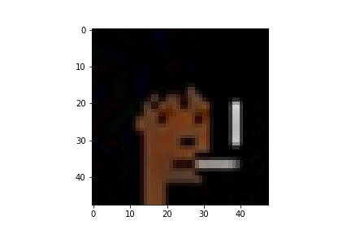

# GAN-trained-image-generation-and-style-transfer-model-for-Anime-and-Cryptopunk-data-sets
GAN trained image generation and style transfer model for Anime and Cryptopunk data sets

Repository has 2 image generation models trained as part of a GAN. models may be used to generate images. Models are trained on either the full Cryptopunk or Anime Face data set.
Trained for 500 epochs on RTX3070Ti.

To generate image, run the generate.ipynb file. You can change the model used for image generation, its light weight and doesn't need a GPU.

generate.ipynb also has a style transfer part to add some personality to any image generation. You will have to change the style source parameter to customize.

Code used for GAN and style transfer taken from Tensorflow examples

https://www.tensorflow.org/tutorials/generative/dcgan

https://www.tensorflow.org/hub/tutorials/tf2_arbitrary_image_stylization

   )
